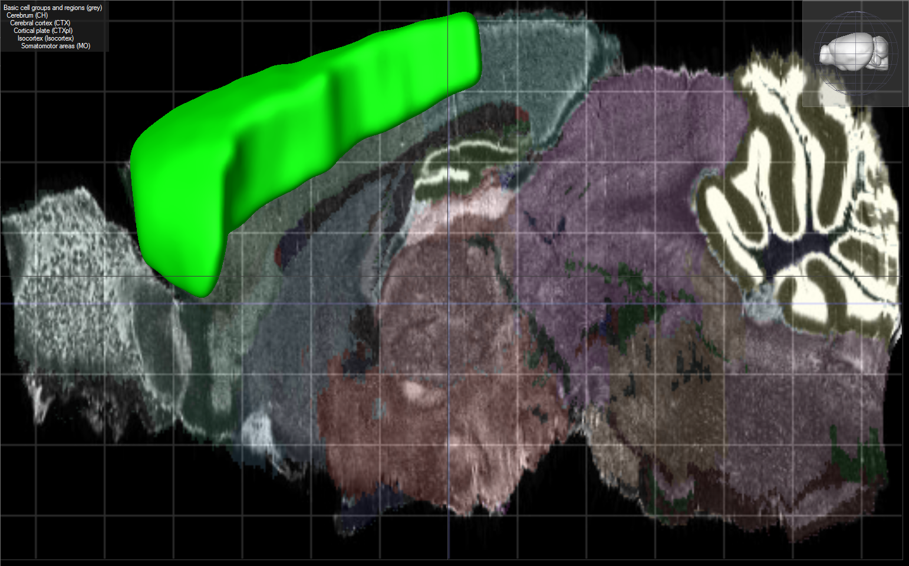
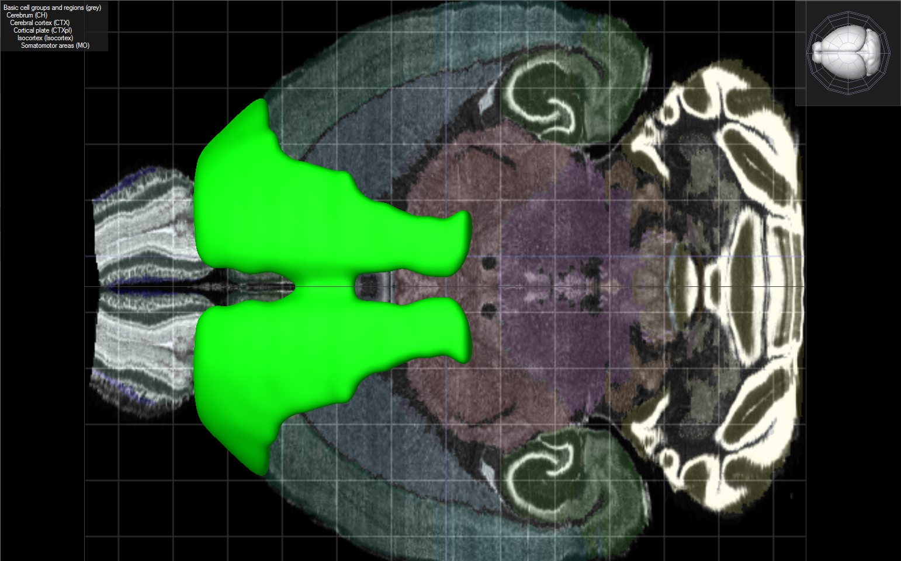
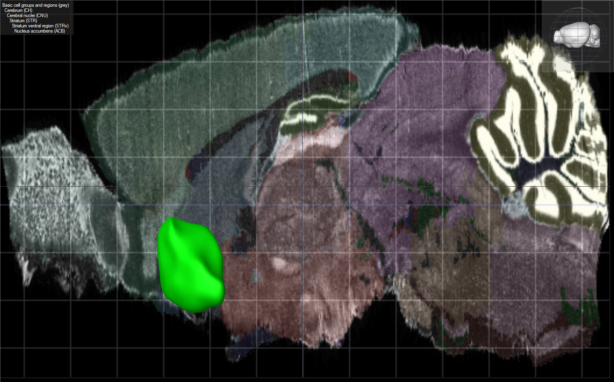
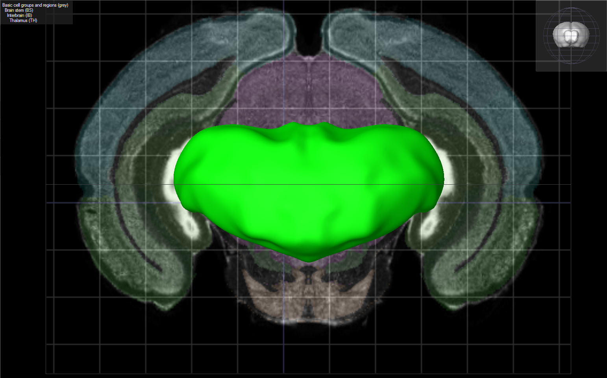
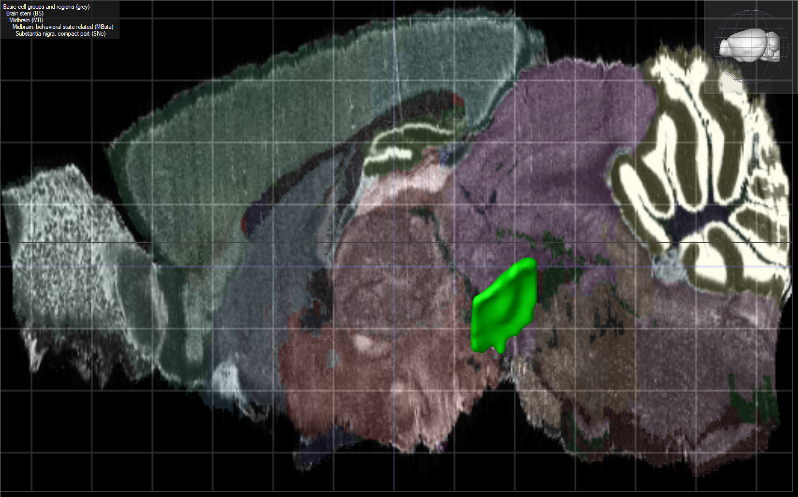
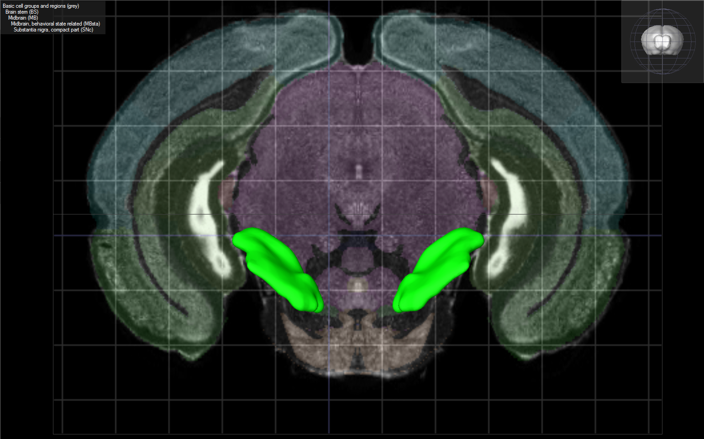
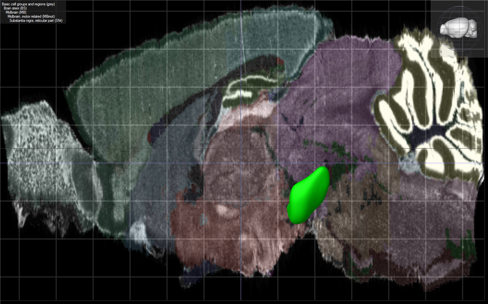
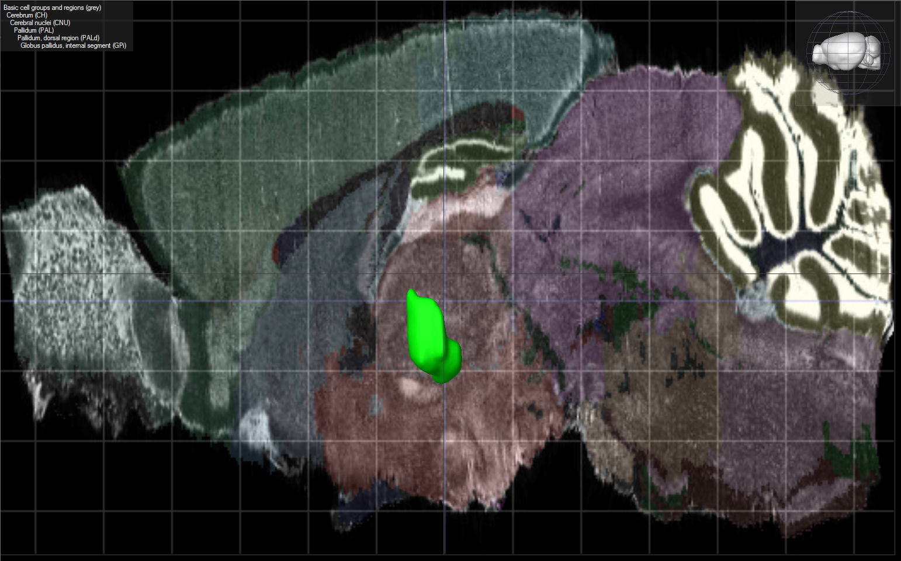
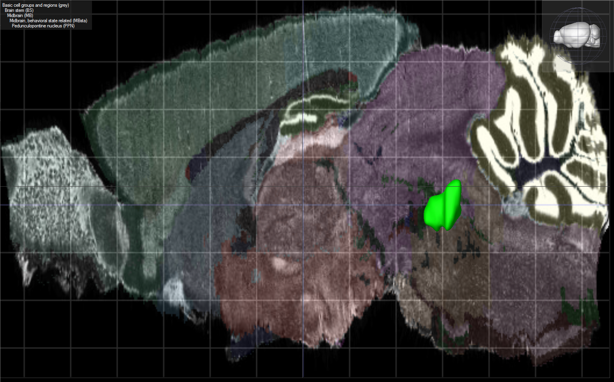

1. **[Nigrostriatal](#nigrostriatal-pathway)**
2. **[Mesocorticolimbic](#mesocorticolimbic-pathway)**
3. **[Integration](#integration)**
4. **[Parts of dopamine pathway](#parts)**

[Janhunen2006]: https://www.researchgate.net/publication/6656868_Janhunen_S_Ahtee_L_Differential_nicotinic_regulation_of_the_nigrostriatal_and_mesolimbic_dopaminergic_pathways_implications_for_drug_development_Neurosci_Biobehav_Rev_31_287-314
[Dongen2007]: http://dare.ubvu.vu.nl/bitstream/handle/1871/11031/6554.pdf
[Jennifer2014]: https://www.researchgate.net/publication/264427777_The_neurobiology_of_methamphetamine_induced_psychosis

Legend:
- **Amygdala**  
- **GPe**: globus pallidus external
- **GPi**: globus pallidus internal
- **Motor Cortex**
- **NAc**: Nucleus Accumbens
	- NAc core
	- NAc shell
- **PPTg**: Pedunculopontine Tegmental nucleus
- **Prefrontal cortex**
- **SNr**: substantia nigra pars reticulata
- **SNc**: substantia nigra pars compacta
- **STN**: subthalamic nucleus
- **Striatum**
- **Thalamus**
- **VTA**: Ventral Tegmental Area

Prefix description:
- **GABA** - GABA
- **Glu** - glutamate
- **ACh** - acetylcholine
- **DA** - dopamine

### About dopamine

### Dopamine synapse and effects

**Advanced scheme**  

========================

### Nigrostriatal pathway

<table>
	<tr align="center">
		<td width="33%">
<<<<<<< Updated upstream
			
		<td width="33%">
			
		<td width="33%">
			
=======
			
		<td width="33%">
			
		<td width="33%">
			
>>>>>>> Stashed changes
	<tr align="center">
		<td>
			<b>
				<a href="https://github.com/research-team/NEUCOGAR/tree/master/nest/dopamine/nigrostriatal/step_1"> Step 1 </a>
		<td>
			<b>
				<a href="https://github.com/research-team/NEUCOGAR/tree/master/nest/dopamine/nigrostriatal/step_2"> Step 2 </a>
		<td>
			<b>
				<a href="https://github.com/research-team/NEUCOGAR/tree/master/nest/dopamine/nigrostriatal/step_3"> Step 3 </a>
	<tr align="center">
		<td colspan="3">
<<<<<<< Updated upstream
			
=======
			
>>>>>>> Stashed changes
</table>

 Source    	| Destination 	| Connection        
-----------:|---------------|-------------------
			|				|
			|				|
			|				|
			|				|
			|				|
			|				|
			|				|
			|				|
			|				|
			|				|
			|				|
			|				|
			|				|
			|				|
			|				|
			|				|
			|				|
			|				|

========================

### Mesocorticolimbic pathway

<table>
	<tr align="center">
		<td>
			  
	<tr align="center">
		<td>
			<a href="https://www.researchgate.net/publication/6656868_Janhunen_S_Ahtee_L_Differential_nicotinic_regulation_of_the_nigrostriatal_and_mesolimbic_dopaminergic_pathways_implications_for_drug_development_Neurosci_Biobehav_Rev_31_287-314">Source</a>
			p291
	<tr>
		<td colspan="3" align="center">
<<<<<<< Updated upstream
			
=======
			
>>>>>>> Stashed changes
</table>

| Source    | Destination | Connection        |
|----------:|-------------|-------------------|
|PFC[Glu1]  | NAc[GABA1]  | Glutamatergic     |
|PFC[Glu1]  | VTA[GABA2]  | Glutamatergic     |
|PFC[Glu0]  | VTA[DA0]    | Glutamatergic     |
|NAc[Ach]   | NAc[GABA1]  | Acetylcholinergic |
|NAc[GABA0] | NAc[GABA1]  | GABAergic         |
|NAc[GABA1] | VTA[GABA2]  | GABAergic         |
|VTA[GABA0] | PFC         | GABAergic         |
|VTA[GABA0] | PPtg[GABA0] | GABAergic         |
|VTA[DA0]   | PFC         | Dopaminergic      |
|VTA[GABA1] | VTA[DA0]    | GABAergic         |
|VTA[GABA1] | VTA[DA1]    | GABAergic         |
|VTA[DA1]   | NAc[GABA1]  | Dopaminergic      |
|VTA[GABA2] | NAc[GABA1]  | GABAergic         |
|PPTg[GABA] | VTA[GABA0]  | GABAergic         |
|PPTg[Ach]  | VTA[GABA0]  | Acetylcholinergic |
|PPTg[Ach]  | VTA[DA1]    | Acetylcholinergic |
|PPTg[GLu]  | VTA[GABA0]  | Glutamatergic     |
|PPTg[Glu]  | VTA[DA1]    | Glutamatergic     |

========================

### Integration

<table>
	<tr align="center">
		<td width="25%">
<<<<<<< Updated upstream
			
		<td width="25%">
			
=======
			
		<td width="25%">
			
>>>>>>> Stashed changes
		<td width="25%">
			 
		<td width="25%">
			
	<tr align="center">
		<td>
			<a href="#nigrostriatal-pathway">Nigrostriatal</a>
		<td>
			<a href="#mesocorticolimbic-pathway">Mesocorticolimbic</a>
		<td>
			<a href="http://dare.ubvu.vu.nl/bitstream/handle/1871/11031/6554.pdf">Source</a>
			p19
		<td>
			<a href="https://www.researchgate.net/publication/264427777_The_neurobiology_of_methamphetamine_induced_psychosis">Source</a>
			p3
	<tr align="center">
		<td colspan="4">
<<<<<<< Updated upstream
			
=======
			
>>>>>>> Stashed changes
</table>

 Source    	| Destination 	| Connection        
-----------:|---------------|-------------------
			|				|
			|				|
			|				|
			|				|
			|				|
			|				|
			|				|
			|				|
			|				|
			|				|
			|				|
			|				|
			|				|
			|				|
			|				|
			|				|
			|				|
			|				|

========================

## Parts 

### Motor cortex 
Sagittal | Coronal    | Horizontal
---------|------------|---------
 |  | 

**Description**  

**Projections**  

**Functions**  

### ▼ Prefrontal cortex 

http://www.sciencedirect.com/science/article/pii/S0306452214007155

Sagittal | Coronal    | Horizontal
---------|------------|---------
		 |			  |

**Description**  

**Projections**  

**Functions**  

### ▼ Striatum
> In all primates the [dorsal striatum](#dorsal-striatum) is divided by a white matter tract called the internal capsule into two sectors called the *caudate nucleus* and **the putamen**. The [ventral striatum](#ventral-striatum) is composed of the **nucleus accumbens** and olfactory tubercle in primates. Functionally, the striatum coordinates multiple aspects of cognition, including motor and action planning, decision-making, motivation, reinforcement, and reward perception.   

#### 1. Dorsal striatum
#### ▶ Putamen

Sagittal | Coronal    | Horizontal
---------|------------|---------
 |  | 

**Description**  

**Projections**  

**Functions**  

#### 2. Ventral striatum

> The ventral striatum is the ventral part of the striatum, which is a major portion of the basal ganglia and functions as part of the reward system. It consists of the *nucleus accumbens* and *olfactory tubercle*. It is associated 	with the limbic system and has been implicated as a vital part of the circuitry for decision making and reward behaviors, including addiction. [Reference](https://en.wikipedia.org/wiki/Ventral_striatum)

#### ▶ NAcc

Sagittal | Coronal    | Horizontal
---------|------------|---------
 |  | 

http://www.jneurosci.org/content/18/17/6650.full.pdf
"GABAergic medium spiny projection neurons constitute the vast majority (~95%) of neurons in the NAcc."

##### ▶ shell
**Description**  
	The nucleus accumbens shell is a substructure of the nucleus accumbens. The shell and core together form the entire nucleus accumbens.

**Projections**  

**Functions**  
	The shell of the nucleus accumbens is involved in the cognitive processing of reward perception and motivational salience for rewarding stimuli (specifically, the NAcc shell determines the value of and assigns the "desire" or "wanting" attribute of a stimulus) as well as positive reinforcement.[6][22] The subset of ventral tegmental area projection neurons that synapse onto the D1-type medium spiny neurons in the shell appear to be responsible for immediate drug reward (i.e., "wanting").[23][24][3] Addictive drugs have a larger effect on dopamine release in the shell than in the core.[6] D2-type medium spiny neurons in the shell appear to be associated with aversion-related cognition.[4] A "hedonic hotspot" or pleasure center which is responsible for the pleasurable or "liking" component of some intrinsic rewards is also located in a small compartment within the NAcc shell.[25]

##### ▶ core

**Description**  
The nucleus accumbens core is the inner substructure of the nucleus accumbens.

**Projections**  

**Functions**  
The nucleus accumbens core is involved in the cognitive processing of motor function related to reward and reinforcement.[6] Specifically, the core encodes new motor programs which facilitate the acquisition of a given reward in the future.[6]

### ▼ Thalamus 

Sagittal | Coronal    | Horizontal
---------|------------|---------
 |  | 

**Description**  

**Projections**  

**Functions**  

### ▼ STN

Sagittal | Coronal    | Horizontal
---------|------------|---------
 |  | 

**Description**  

**Projections**  

**Functions**  

### ▼ Substancia nigra

#### ▶ pars compacta

Sagittal | Coronal    | Horizontal
---------|------------|---------
 |  | 

**Description**  

**Projections**  

**Functions**  

#### ▶ pars reticulata

Sagittal | Coronal    | Horizontal
---------|------------|---------
 |  | 

**Description**  

**Projections**  

**Functions**  

### ▼ Globus  Pallidus

#### ▶ internal

Sagittal | Coronal    | Horizontal
---------|------------|---------
 |  | 

**Description**  

**Projections**  

**Functions**  

#### ▶ external

Sagittal | Coronal    | Horizontal
---------|------------|---------
 |  | 

**Description**  

**Projections**  

**Functions**  

### ▼ VTA

Sagittal | Coronal    | Horizontal
---------|------------|---------
 |  | 

**Description**  
The VTA is the origin of the dopaminergic cell bodies of the mesocorticolimbic dopamine system and is widely implicated in the drug and natural reward circuitry of the brain. It is important in cognition, motivation, orgasm,[2] drug addiction, intense emotions relating to love, and several psychiatric disorders. The VTA contains neurons that project to numerous areas of the brain, from the prefrontal cortex (PFC) to the caudal brainstem and several regions in between.

**Projections**  

**Functions**  
As stated above, the VTA, in particular the VTA dopamine neurons, serve several functions in the reward system, motivation, cognition, drug addiction, and may be the focus of several psychiatric disorders. It has also been shown to process various types of emotion output from the amygdala, where it may also play a role in avoidance and fear-conditioning. Electrophysiological recordings have demonstrated that VTA neurons respond to novel stimuli, unexpected rewards, and reward-predictive sensory cues. The firing pattern of these cells is consistent with the encoding of a reward expectancy error. In 2006 MRI Studies by Helen Fisher and her research team found and documented various emotional states relating to intense love correlated with activity in the VTA, which may help explain obsessive behaviors of rejected partners since this is shared by the reward system.

### ▼ PPTg

Sagittal | Coronal    | Horizontal
---------|------------|---------
 |  | 

**Description**  
The pedunculopontine tegmental nucleus (PPTg) and laterodorsal tegmental nucleus (LDTg) provide cholinergic afferents to several brain areas. This cholinergic complex has been suggested to play a role in sleep, waking, motor function, learning and reward.  (http://www.ncbi.nlm.nih.gov/pmc/articles/PMC3833361/)

The pedunculopontine nucleus (PPN) (or pedunculopontine tegmental nucleus, PPTN or PPTg) is located in the brainstem, caudal to the substantia nigra and adjacent to the superior cerebellar peduncle. It has two divisions, one containing cholinergic neurons, the pars compacta, and one containing mostly glutamatergic neurons, the pars dissipata. The PPN is one of the main components of the reticular activating system. 

(Garcia-Rill E. (1991). The pedunculopontine nucleus. Prog Neurobiol. 36(5):363-89. PMID 1887068)  
(Winn P. (2006). How best to consider the structure and function of the pedunculopontine tegmental nucleus: evidence from animal studies. J Neurol Sci. 25;248(1-2):234-50. PMID 16765383)

**Projections**  
PPN neurons project axons to a wide range of areas in the brain,[5] particularly parts of the basal ganglia such as the subthalamic nucleus, substantia nigra pars compacta, and globus pallidus internus. It also sends them to targets in the thalamus, cerebellum, basal forebrain, and lower brainstem, and in the cerebral cortex, the supplementary motor area and somatosensory and motor cortices.[1],[2],[6]

It receives inputs from many areas of the brain,[7] including the basal ganglia to which it projects with the exception of the substantia nigra pars compacta to which it projects but does not receive, while it receives but does not project to the substantia nigra pars reticulata.[1],[2]

**Functions**    
The PPN is involved in many functions, including arousal, attention, learning, reward, and voluntary limb movements and locomotion.[8],[9] While once thought important to the initiation of movement, recent research suggests a role in providing sensory feedback to the cerebral cortex.[8] It is also implicated in the generation and maintenance of REM sleep.[10]

Recent research has discovered that the PPN is involved in the planning of movement, and that different networks of neurons in the PPN are switched on during real and imagined movement.[9]

### ▼ Amygdala

Full table of neuron number

Part									|Neuron number   	| Link
----------------------------------------|-------------------|-----
**Motor cortex**						|					| [[1](#motor-cortex)]
motor cortex[Glu0]						|29000000 * 0.8 /6	| 
motor cortex[Glu1]						|29000000 * 0.2 /6	| 
**Striatum**							|					| [[2](#striatum)]
striatum[D1]							|2500000 * 0.425	| 
striatum[D2]							|2500000 * 0.425	| 
striatum[tan]							|2500000 * 0.05		| 
**Globus pallidus**						|					| [[3](#globus-pallidus)]
gpe[GABA]								|84100				| 
gpi[GABA]								|12600				|
**Subthalamic nucleus**					|					| [[4](#subthalamic-nucleus)]
stn[Glu]								|22700				
**Substancia nigra**					|					| [[5](#substancia-nigra)]
snc[GABA]								|3000
snc[DA]									|12700
snr[GABA]								|47200
**Thalamus**							|					| [[5](#thalamus)]
thalamus[Glu]							|5000000 / 6
**Prefrontal cortex**					|					| [[6](#prefrontal-cortex)]
prefrontal cortex[Glu0]					|183000
prefrontal cortex[Glu1]					|183000
**Nucleus Accumbens**					|					| [[7](#nucleus-accumbens)]
nac[ACh]								|1500
nac[GABA0]								|14250
nac[GABA1]								|14250
**Ventral tegemntal area**				|					|[[8](#vta)]
vta[GABA0]								|7000
vta[DA0]								|20000
vta[GABA1]								|7000
vta[DA1]								|20000
vta[GABA2]								|7000
**Pedunculopontine tegmental nucleus**	|					|[[9](#pptg)]
tpp[GABA]								|2000
tpp[ACh]								|1400
tpp[Glu]								|2300
**Amygdala**							|					|[[10](#amygdala)]
amygdala[Glu]							|30000

## Reference

1. [Janhunen, S. & Ahtee, L.: Differential nicotinic regulation of the nigrostriatal and mesolimbic dopaminergic pathways: implications for drug development. Neuroscience & Biobehavioral Reviews (Impact Factor: 8.8). 02/2007; 31(3):287-314.][Janhunen2006]  
	DOI: 10.1016/j.neubiorev.2006.09.008
2. [van Dongen, Yvette Charlotte: Direct and indirect communication between functionally different regions of the rat striatum (2007)][Dongen2007]  
	DOI: -
3. [Jennifer H. Hsieh, Dan J. Stein  and Fleur M. Howells: The neurobiology of methamphetamine induced psychosis. Frontiers in Human Neuroscience (Impact Factor: 3.63). 07/2014; 8:537. ][Jennifer2014]  
	DOI: 10.3389/fnhum.2014.00537
4. 4
